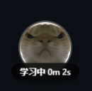
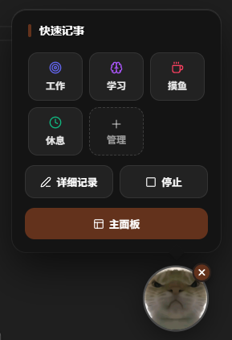
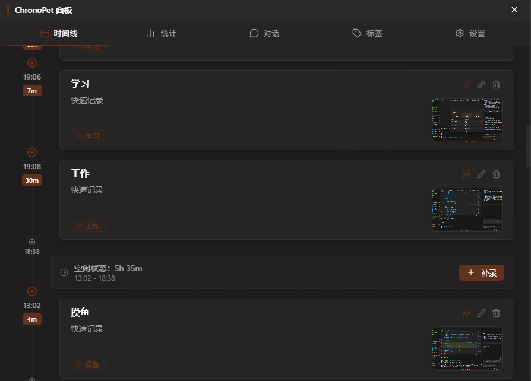

# ChronoPet (时光宠)

ChronoPet 是一款用于时间管理的桌面宠物应用。它常驻于你的桌面上，你可以通过与它交互来记录时间并回顾你的一天。

## 主要功能

- **桌面宠物**：一个始终悬浮在其他窗口之上的可爱小宠物。
  - 
- **快速记录**：左键点击宠物即可快速记录你当前正在做的事情。
  - 
  - 支持直接粘贴图片（截图）。
  - "捕获屏幕" 按钮可自动截取当前屏幕。
  - 内置 AI 总结功能，自动生成任务描述。
- **大屏面板**：右键点击宠物可打开管理面板。
  - 
  - **时间线**：以时间轴形式查看日常记录，包含截图预览。
  - **统计**：直观查看各项活动的投入时长和分布。
  - **对话**：与 ChronoPet 进行对话，回顾和分析你的每一天（由 AI 提供支持）。
- **数据持久化**：所有记录均安全存储在本地 `userData` 文件夹中。
- **高度自定义**：支持自定义标签、颜色以及对应的桌宠外观。

## 开发指南

1. 安装依赖：

   ```bash
   pnpm install
   ```

2. 运行开发模式：
   ```bash
   npm run dev
   ```
   （注意：使用 `concurrently` 同时运行 Vite 和 Electron）

## 构建打包

构建可执行文件：

```bash
npm run build
```

构建后的安装包/执行文件将生成在 `dist` 或 `release` 目录下。

## 技术栈

- **Electron**：提供桌面能力（透明窗口、置顶显示、屏幕捕获等）。
- **React**：用于构建用户界面。
- **Vite**：高性能的前端构建工具。
- **Win11 毛玻璃效果**：使用原生 CSS 实现的现代感界面。
- **Lucide React**：精美的一致性图标库。

---

由 AI 为你打造的时间管理新体验。
